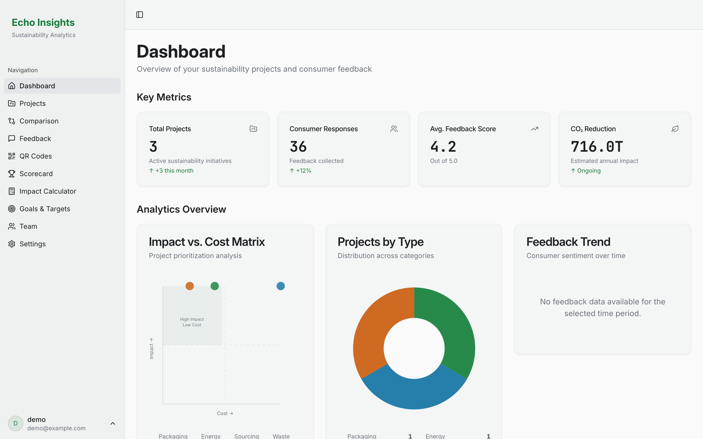
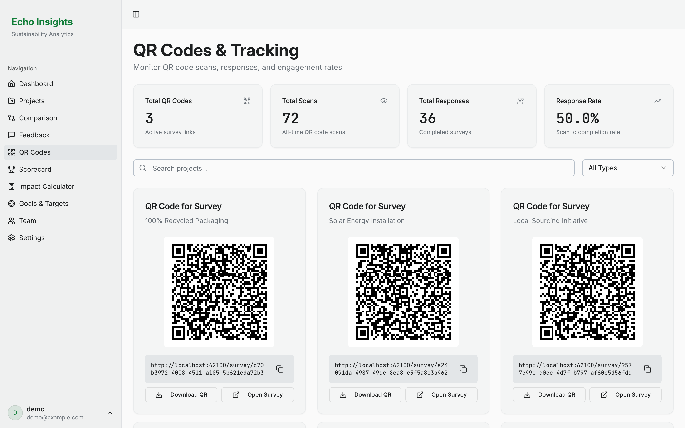
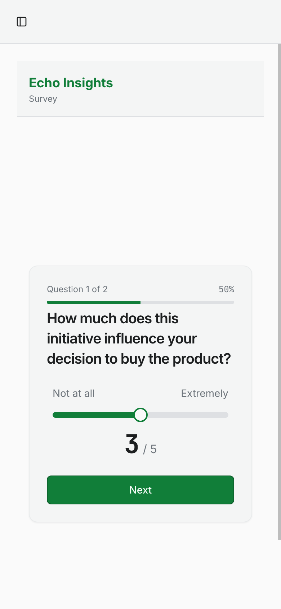
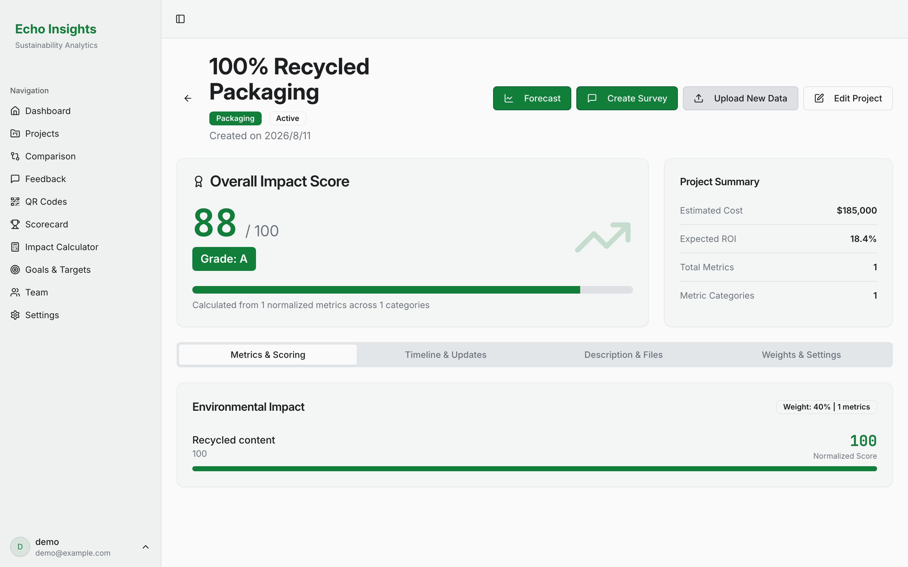

# Echo Insights

[](https://github.com/lglj3321/echo-insights/actions/workflows/ci.yml)

**Sustainability analytics for food companies — operational impact and consumer
sentiment, scored side by side.**

Food companies run more sustainability initiatives than they can fund. Recycled
packaging, solar installation, local sourcing and waste reduction all compete
for the same budget, and the business case for each is usually assembled from
whatever spreadsheet the project owner happens to keep.

Echo Insights brings both halves of that decision together: the operational
numbers — cost, ROI, CO₂ and water saved — and what consumers actually think,
collected anonymously through QR-code surveys printed on the product.

Built as a full-stack serverless application on Vercel and Neon PostgreSQL.

**▶ [Try the live demo](https://echoinsights.vercel.app)** — sign up with any
username; the account is yours and starts empty, so you can create a project,
generate its QR code and answer the survey from your phone.



## How it works

1. **Create a project.** Upload a spreadsheet and Echo Insights extracts its
   metrics, then classifies the initiative into a sustainability category from
   the description.
2. **Publish the survey.** Each project gets a QR code and a survey link,
   generated against whatever origin the app is served from.
3. **Collect responses.** Scanning opens a full-screen mobile survey — no
   dashboard, no login, no personal data. Scans and completions are tracked
   separately so response rate is a real number.
4. **Compare and decide.** Impact-versus-cost positioning, weighted impact
   scores, category breakdowns and consumer sentiment update across the
   dashboard, the QR tracking view and each project's detail page.

<p>
  
  
</p>

## Cloud architecture

The deployment target shaped most of the interesting decisions, so they are
worth stating rather than leaving to be inferred.

```text
                    ┌──────────────────────────────┐
   Consumer         │        Vercel Edge CDN       │
   (phone, QR) ────▶│  static client bundle        │
                    │  SPA fallback rewrite        │
   Operator         └──────────────┬───────────────┘
   (dashboard) ────▶               │ /api/*
                                   ▼
                    ┌──────────────────────────────┐
                    │  Vercel Serverless Function  │
                    │  api/index.ts                │
                    └──────────────┬───────────────┘
                                   │ WebSocket
                                   ▼
                    ┌──────────────────────────────┐
                    │   Neon PostgreSQL (pooled)   │
                    └──────────────────────────────┘
```

**Neon's serverless driver, not a conventional PostgreSQL client.** A serverless
function is frozen between invocations and cannot hold a TCP connection pool
open. `@neondatabase/serverless` reaches the database over a WebSocket to Neon's
proxy, so connection management happens server-side and a traffic spike does not
exhaust the connection limit.

**Stateless JWTs, not server-side sessions.** The application originally used
`express-session` with an in-process store. That store lives in one function
instance's memory, and Vercel runs many instances — a session written by one is
invisible to the next. Signed tokens let any instance serve any request, which
is what horizontal scaling requires.

**Route registration memoised per instance.** `registerRoutes` is asynchronous
and mounts every handler. `api/index.ts` guards it with a module-scope flag, so
a cold start pays for registration once and warm invocations skip it.

**One application, two entry points.** `api/index.ts` wraps the Express app as a
serverless handler; `server/dev.ts` mounts the same app behind a port with Vite
in middleware mode. All routing and storage live in `api/_lib`, which is what
keeps local and deployed behaviour from drifting apart.

Full reasoning, trade-offs and deployment steps: **[docs/architecture.md](docs/architecture.md)**.

## Getting started

```bash
npm ci
npm run dev
```

Open <http://localhost:3000>. No database, API key or account required — without
`DATABASE_URL` the app runs on an in-memory adapter, so you can register an
account and click through the whole product immediately.

### With PostgreSQL

```bash
cp .env.example .env    # set DATABASE_URL and JWT_SECRET
npm run db:push
npm run dev
```

## Security

Authentication is JWT-based. Authorization is enforced by two middlewares in
`api/_lib/auth.ts`: `requireAuth` validates the token, and
`requireProjectOwnership` rejects callers who do not own the project named in
the route.

An earlier revision applied these checks route by route, and several mutating
endpoints were left without any middleware — a project could be renamed, and its
metrics modified or deleted, with no credentials at all. The checks are now
centralised, and `api/_lib/authorization.test.ts` covers every request that was
previously reachable, so the gap cannot silently reopen.

The consumer survey path is deliberately anonymous: reading a project's
questions, recording a scan and submitting a response all work without an
account, because respondents are members of the public. Responses carry no
identifiers.



## Capabilities

**Project intake** — spreadsheet upload with vertical metric extraction and CSV
delimiter detection; AI-assisted categorisation that degrades to keyword
matching when no model endpoint is configured.

**Consumer feedback** — per-project survey questions, anonymous mobile response
capture, scan-to-completion tracking, and NPS-style breakdowns of the results.

**Decision support** — weighted impact scoring, impact-versus-cost matrix,
category distribution, project comparison separating shared from unique metrics,
and forecasting from recorded metrics.

**Distribution** — downloadable QR codes and shareable survey links per project.

## Repository layout

```text
api/index.ts     Vercel serverless entry point
api/_lib/        Express app, routes, storage, auth, scoring, forecasting
client/          React + Vite single-page app
server/dev.ts    Local entry point onto the same app
shared/schema.ts Drizzle tables; source of both API validation and client types
```

`shared/schema.ts` declares the tables once. `drizzle-zod` derives the insert
validators the API enforces, and the inferred types flow into the React client,
so a column change propagates to request validation and client types together.

### Stack

React · TypeScript · Vite · Tailwind · shadcn/ui · TanStack Query · Recharts ·
Express · Drizzle ORM · Zod · Neon PostgreSQL · JWT · Vitest · Supertest ·
Vercel

## Development

```bash
npm run check   # TypeScript
npm test        # API and authorization tests
npm run build   # client bundle
```

CI runs all three on every push and pull request. The tests use the in-memory
adapter, so CI needs no database and no secrets.

## Engineering notes

- **Schema push, not migrations.** `npm run db:push` applies the schema
  directly — appropriate in development, unsuitable for production data.
  Generated migrations are the outstanding item before this carries data that
  matters.
- **Figures are illustrative.** Seeded metrics and the impact calculator's
  conversion factors demonstrate the interface; they are not audited
  environmental reporting and should not be used for disclosure.
- **Single client bundle.** ~1.1 MB, not yet code-split.
- **In-memory storage is not a deployment mode.** It exists for local
  development and tests; in a serverless environment its contents are
  per-instance and vanish on recycle.

## Roadmap

- Generated, reviewable database migrations
- Persist response timestamps so sentiment trends cover real history
- Code-split the client bundle
- Rate limiting on the anonymous survey endpoints

## Background

Echo Insights was built for *Applied Project in Enterprise Cloud Design and
Development*, a university course, and has run on Vercel with a Neon PostgreSQL
backend since November 2025. It is maintained as a portfolio piece rather than
a supported service — see [Engineering notes](#engineering-notes) for what that
means in practice.

See [docs/architecture.md](docs/architecture.md) for the deployment topology and
the decisions behind it, and [docs/product-report.md](docs/product-report.md)
for the original product write-up.

## License

[MIT](LICENSE)
